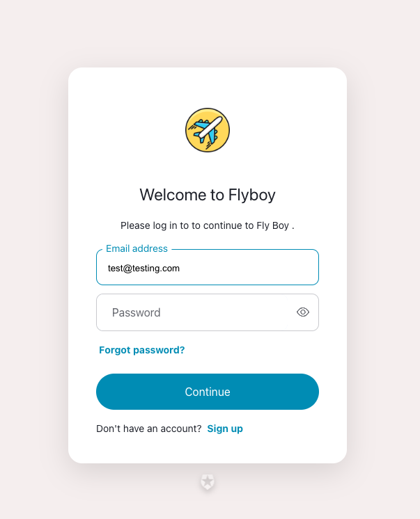
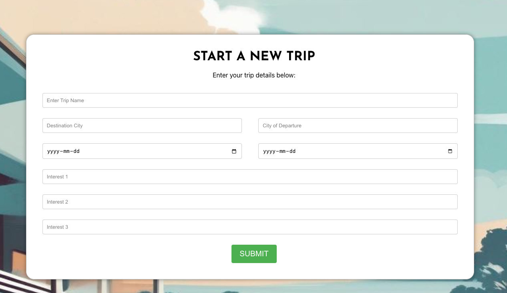
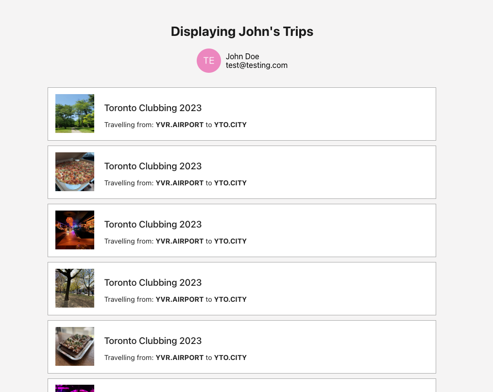

<!-- PROJECT LOGO -->
<br />
<div align="center">
  <a href="https://github.com/othneildrew/Best-README-Template">
    
  </a>

  <h3 align="center">FLYBOY.TRAVEL</h3>

  <p align="center">
 Here's our Official Documentation!
<br />
<a href="https://github.com/heXagon-bcd/lhlfinal_flyboy/blob/master/README.me"><strong>Explore the docs »</strong></a>

  </p>
</div>

<details>
  <summary>Table of Contents</summary>
  <ol>
    <li>
      <a href="#about-the-project">About The Project</a>
      <ul>
        <li><a href="#built-with">Built With</a></li>
      </ul>
    </li>
    <li>
      <a href="#getting-started">Getting Started</a>
      <ul>
        <li><a href="#prerequisites">Prerequisites</a></li>
        <li><a href="#installation">Installation</a></li>
      </ul>
    </li>
    <li><a href="#usage">Usage</a></li>
    <li><a href="#roadmap">Roadmap</a></li>
    <li><a href="#contributing">Contributing</a></li>
    <li><a href="#license">License</a></li>
    <li><a href="#contact">Contact</a></li>
    <li><a href="#acknowledgments">Acknowledgments</a></li>
  </ol>
</details>

## About The Project

![Flyboy_background]

If you love travelling, you’ll know planning for a memorable trip is the worst part.

WE created this travel app to deal with that headache. Flyboy allows you to plan a trip’s itinerary with Yelp’s API to recommend top-rated spots and the booking.com API for the best accommodation deals. Plan last minute or plan in advance, this was designed to build you a full trip itinerary plan for a seamless unforgettable experience.

This project puts together all the learnings throughout 6 months of coding.

### Built With

![React]![React Router]![Postgres]![NodeJS]![Express.js]![CSS3]![HTML5]![JavaScript]

## Getting Started

## Front End Installation

Go into the frontend folder

### `npm -i`

Install all the dependencies listed in the package.json. When you run this command, npm will look at the dependencies and devDependencies

### `npm start`

Launches the browser and waits for server interaction to load Create React App

#### Go into .env

```js
REACT_APP_API_SERVER_URL=http://localhost:3002
REACT_APP_AUTH0_DOMAIN=your auth0 domain
REACT_APP_AUTH0_CLIENT_ID=your client data
REACT_APP_AUTH0_CALLBACK_URL=http://localhost:3002/callback
```

## Back End Installtion

Go into the backend folder

### `npm -i`

Install all the dependencies listed in the package.json. When you run this command, npm will look at the dependencies and devDependencies

## Setup

1. Create the `.env` by using `.env.example` as a reference: `cp .env.example .env`
2. Update the .env file with your correct local information

- username: `yourname`
- password: `yourpassword`
- database: `flyboy`

3. Install dependencies: `npm i`
4. Fix to binaries for sass: `npm rebuild node-sass`
5. Reset database: `npm run db:reset`

- Check the db folder to see what gets created and seeded in the SDB

7. Run the server: `npm run local`

- Note: nodemon is used, so you should not have to restart your server

8. Visit `http://localhost:8080/` and it will serve the react file.

## Warnings & Tips

- Do not edit the `layout.css` file directly, it is auto-generated by `layout.scss`.
- Split routes into their own resource-based file names, as demonstrated with `users.js` and `widgets.js`.
- Split database schema (table definitions) and seeds (inserts) into separate files, one per table. See `db` folder for pre-populated examples.
- Use helper functions to run your SQL queries and clean up any data coming back from the database. See `db/queries` for pre-populated examples.
- Use the `npm run db:reset` command each time there is a change to the database schema or seeds.
  - It runs through each of the files, in order, and executes them against the database.
  - Note: you will lose all newly created (test) data each time this is run, since the schema files will tend to `DROP` the tables and recreate them.

## Dependencies

- Node 10.x or above
- NPM 5.x or above
- PG 6.x

## API FLOW

- express server creates routes
  -cors allows communcation between server and browser

## Features

### AUTH0

Auth0 is to authenticate users and push to our postgres database


### FORMIK

Formik is used to create forms and handle data transmission



### Saved searches

Once the search is complete, you can view your interary and save them!



<!-- Markdown links & Images -->

[React]: https://img.shields.io/badge/react-%2320232a.svg?style=for-the-badge&logo=react&logoColor=%2361DAFB
[React Router]: https://img.shields.io/badge/React_Router-CA4245?style=for-the-badge&logo=react-router&logoColor=white
[Postgres]: https://img.shields.io/badge/postgres-%23316192.svg?style=for-the-badge&logo=postgresql&logoColor=white
[NodeJS]: https://img.shields.io/badge/node.js-6DA55F?style=for-the-badge&logo=node.js&logoColor=white
[Express.js]: https://img.shields.io/badge/express.js-%23404d59.svg?style=for-the-badge&logo=express&logoColor=%2361DAFB
[CSS3]: https://img.shields.io/badge/css3-%231572B6.svg?style=for-the-badge&logo=css3&logoColor=white
[HTML5]: https://img.shields.io/badge/html5-%23E34F26.svg?style=for-the-badge&logo=html5&logoColor=white
[JavaScript]: https://img.shields.io/badge/javascript-%23323330.svg?style=for-the-badge&logo=javascript&logoColor=%23F7DF1E
[Flyboy_Background]: frontend/public/flyboy_background.png
